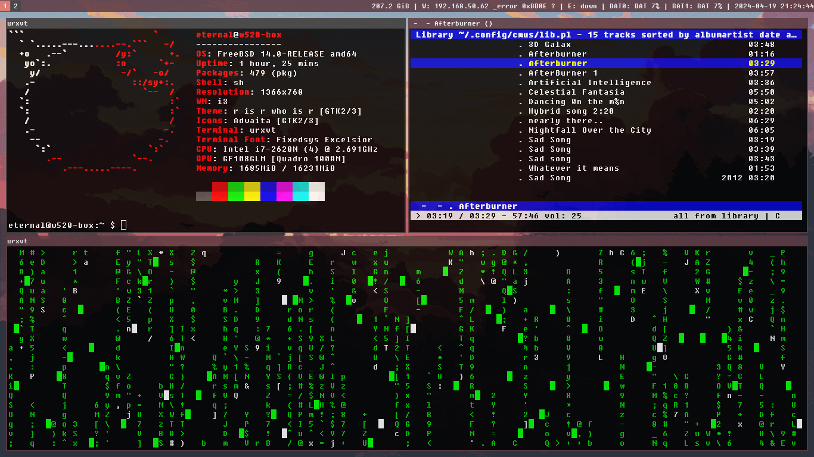
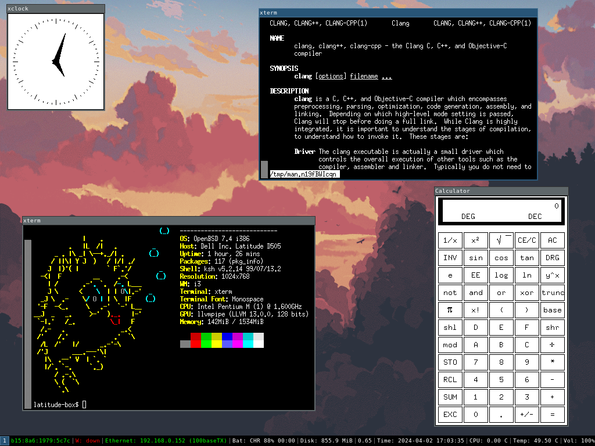
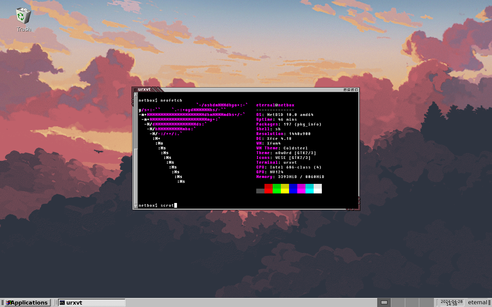

# My Hardware Stack (Work In Progress)

I own a handful of devices, bellow is a detailed list covering them. 

### Main Workstation [eternal@archlinux-laptop]

- OS: Arch Linux x86_64
- Host: Inspiron 16 Plus 7630
- Display (BOE0B29): 2560x1600 @ 120Hz [Built-in]
- WM: Hyprland (Wayland)
- CPU: 13th Gen Intel(R) Core(TM) i7-13700H (20) @ 5.00 GHz
- GPU 1: NVIDIA GeForce RTX 3050 6GB Laptop GPU
- GPU 2: Intel Iris Xe Graphics @ 1.50 GHz
- Memory: 16GB DDR5 3200mhz
- Disk 512GB NVME

This is my main laptop I use for school and work.

---

## Thinkpad W520 [eternal@w520-box]

- OS: FreeBSD 14.0-RELEASE amd64
- Host: Thinkpad w520
- Display 1366x768 @ 59.85Hz [Built In] 
- WM: i3
- CPU: Intel I7-2620M (4) @ 2.691Ghz
- GPU Nvidia Quadro 1000M
- Memory 16G DDR3 
- Disk: 512 HDD, 256GB SSD

I got this thinkpad for 50$ AUD off facebook marketplace to run FreeBSD on due to its greatly supported hardware.

---

## Dell Latitude D505 [latitude-box$]

- OS: OpenBSD 7.4 I386
- Host: Dell Inc. Latitude D505
- Resolution 1024x768 @ UnknownHz [Built In]
- WM: i3
- CPU: Intel Pentium M (1) @ 1.6 Ghz
- GPU: N/A
- Memory: 1.5GB DDR SDRAM
- Disk: 60GB HDD

I got this as well off facebook marketplace for 35$ AUD to learn about i386 CPU architexture, OpenBSD was a great choice due to its ancient hardware, unfortunately the motherboard died 2 weeks later as shown by a flashing caps lock light on boot, It has now been stripped for parts.

But thats not the end to the story, The half finished rice you see in the screenshot, I continued/remade on my thinkpad w520!

**Edit:** This also ran 9front i386 for a shortwhile due to having support ethernet, but I switched to OpenBSD because I had set 9front up on a VM on my main workstation.

---

## 970-desktop [cinny@970-desktop]

- OS: NixOS 24.05 Uakari / NetBSD 10
- Host: GA-H81M-DS2 (rev. 1.0) Gigabyte Motherboard
- Display: (LEN D32qc-20) 2560x1440 @ 60Hz [External]
- WM: Hyprland / Xfce
- CPU: Intel Core I5-4670 (4) @ 3.8 GHz
- GPU: Nvidia 970 Turbo
- Memory: 12GB DDR3 Ram 
- Disk: 512 SSD, 2TB HHD

This was my one of my dads old gaming pc's that has been sitting in the shed for years.

I thought I could repurpose this dusty desktop with some cleaning and a 970 Turbo (bought off Facebook marketplace for 40$ aud). 

I originally installed NetBSD as it was my only device at the time that could actually boot NetBSD and had supported ethernet, however I found out I had unsupported nvidia drivers which led to a very slow desktop experience, however most modern Linux distros had perfect support for my legacy card. 

I installed NixOS because I wanted a device to run my newly integrated Hyprland setup on my [flake](https://github.com/eternalblissed/nixos-config), which worked perfectly.

Although being a a GPU released almost 10 years ago, the 970 Turbo still can run most modern games such as Portal 2, CSGO 2 and Minecraft 1.20.4.

---

