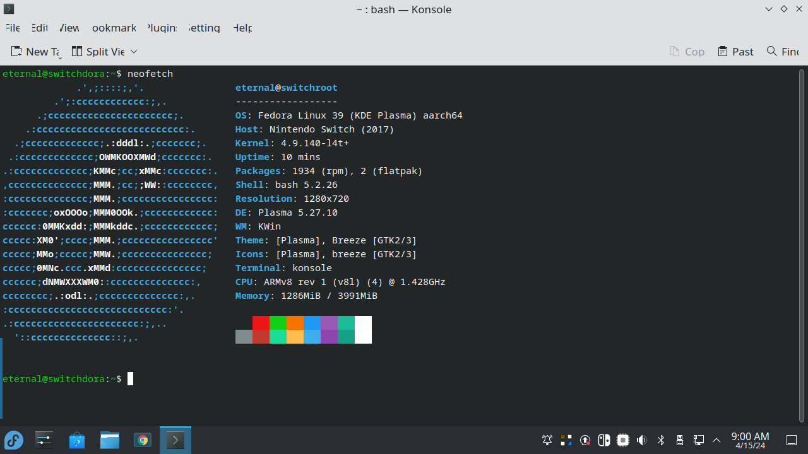

# My Hardware Stack (Work In Progress)

I own a handful of devices, bellow is a detailed list covering them. 

### Main Workstation [eternal@archlinux-laptop]

- OS: Arch Linux x86_64
- Host: Inspiron 16 Plus 7630
- Display (BOE0B29): 2560x1600 @ 120Hz [Built-in]
- WM: Hyprland (Wayland)
- CPU: 13th Gen Intel(R) Core(TM) i7-13700H (20) @ 5.00 GHz
- GPU 1: NVIDIA GeForce RTX 3050 6GB Laptop GPU
- GPU 2: Intel Iris Xe Graphics @ 1.50 GHz
- Memory: 16GB DDR5 3200mhz
- Disk 512GB NVME

This is my main laptop I use for school and work. Apart from being overkill, theres nothing special about it!

---

## Thinkpad W520 [eternal@w520-box]

- OS: FreeBSD 14.0-RELEASE amd64
- Host: Thinkpad w520
- Display 1366x768 @ 59.85Hz [Built In] 
- WM: i3
- CPU: Intel I7-2620M (4) @ 2.691Ghz
- GPU Nvidia Quadro 1000M
- Memory 16G DDR3 
- Disk: 512 HDD, 256GB SSD

I got this thinkpad for 50$ AUD off facebook marketplace to run FreeBSD on due to its greatly supported hardware.

---

## Dell Latitude D505 [latitude-box$]

- OS: OpenBSD 7.4 I386
- Host: Dell Inc. Latitude D505
- Resolution 1024x768 @ UnknownHz [Built In]
- WM: i3
- CPU: Intel Pentium M (1) @ 1.6 Ghz
- GPU: N/A
- Memory: 1.5GB DDR SDRAM
- Disk: 60GB HDD

I got this as well off facebook marketplace for 35$ AUD to learn about i386 CPU architexture, OpenBSD was a great choice due to its ancient hardware, unfortunately the motherboard died 2 weeks later as shown by a flashing caps lock light on boot, It has now been stripped for parts.

But thats not the end to the story, The half finished rice you see in the screenshot, I continued/remade on my thinkpad w520!

**Edit:** This also ran 9front i386 for a shortwhile due to having support ethernet, but I switched to OpenBSD because I had set 9front up on a VM on my main workstation.

---

## 970-desktop [cinny@970-desktop]

- OS: NixOS 24.05 Uakari / NetBSD 10
- Host: GA-H81M-DS2 (rev. 1.0) Gigabyte Motherboard
- Display: (LEN D32qc-20) 2560x1440 @ 60Hz [External]
- WM: Hyprland / Xfce
- CPU: Intel Core I5-4670 (4) @ 3.8 GHz
- GPU: Nvidia 970 Turbo
- Memory: 12GB DDR3 Ram 
- Disk: 512 SSD, 2TB HHD

This was my one of my dads old gaming pc's that has been sitting in the shed for years.

I thought I could repurpose this dusty desktop with some cleaning and a 970 Turbo (bought off Facebook marketplace for 40$ aud). 

I originally installed NetBSD as it was my only device at the time that could actually boot NetBSD and had supported ethernet, however I found out I had unsupported nvidia drivers which led to a very slow desktop experience, however most modern Linux distros had perfect support for my legacy card. 

I installed NixOS because I wanted a device to run my newly integrated Hyprland setup on my [flake](https://github.com/eternalblissed/nixos-config), which worked perfectly.

Although being a a GPU released almost 10 years ago, the 970 Turbo still can run most modern games such as Portal 2, CSGO 2 and Minecraft 1.20.4.

---

## Thinkpad X200 [eternal@x200]

- OS: Arch Linux x86_64
- Host: 7458AW5 (Thinkpad X200)
- Display: (LEN4010) 1280x80 @ 60Hz
- WM: Sway
- CPU: Intel Core 2 Duo (2) @ 2.40 GHz
- GPU: Intel Mobile 4 Series Chipset Integrated Graphics Controller
- Memory: 4G DDR3
- Disk: 128GB SSD

This is a librebooted Thinkpad x200 I got off Facebook marketplace to learn flashing firmware, custom BIOS firmware and how libreboot works.

It was originally running Debian 12 with GNOME but I put Arch with a custom rice (which kinda sucks) built off an already existing sway rice which I made on a seperate laptop.

---

## Ideacentre 310S-08ASR 

- OS: Void Linux Musl x86_64
- Host: 90G900BKAU ideacentre 310S-08ASR (Insane Name)
- Resolution: 1920x1080 [External Monitor]
- WM: Sway
- CPU: AMD A9-9425 RADEON R5 2C+3G (2)
- GPU: Nvidia Geforce GT 730
- Disk: 256GB SSD

Before e-waste dumpster diving was banned in my city (now considered theft due to the potential for devices to contain unwiped personal files) I found this in an Officeworks waste bin without an SSD or DVD drive.

After cleaning, finding a powercord and installing a spare SSD, I installed Void Linux with the Musl varient due to its low performance, and built a custom rice from scratch which was remenant of an older rice I had when I used to use KDE 5 on my Main workstation!

However, the GPU's HDMI had died in a month after using it, So I stripped it for parts.

The original rice.

---

## Nintendo Switch V1 [eternal@switchdora]

- OS: Fedora Linux 39 (KDE Plasma) aarch64
- Host: Nintendo Switch (2017)
- Resolution: 1280x720
- DE: Plasma 5.27.10
- CPU: ARMv8 rev 1 (v8l) (4) @ 1.428Ghz
- GPU: custom Nvidia Tegra X1 SoC
- Memory: 4GB LPDDR4 RAM.
- Disk: 32GB of internal NAND memory.

Your proberly wandering "How in fucks name did you get Fedora 39 on a Nintendo Switch!" well I'll tell you.

The Switch v1 exploit, also known as "Fusée Gelée," is a coldboot vulnerability found in the ROM of the Nvidia Tegra X1 chip, which is used in the original Nintendo Switch. This exploit allows for the execution of custom code on the device's boot processor before the operating system (Horizon OS) starts. The vulnerability stems from the bootrom's inability to properly protect against incorrect length parameters during a direct memory access (DMA) operation. Specifically, a malformed length argument can trigger a buffer overflow, allowing an attacker to execute arbitrary code.

The exploit was made public by "hacker" Kate Temkin and the ReSwitched team in 2018. It is notable because it is hardware-based, meaning Nintendo cannot patch it via software updates in affected units. As a result, any Switch with the vulnerable Tegra X1 chip can be permanently exploited for things like running homebrew software or operating system-level hacks.

Using this, I was able to install/flash [L4T Fedora 39](https://wiki.switchroot.org/wiki/linux/l4t-fedora-installation-guide) onto a 64G SD card and boot into it using [Hekate bootloader](https://github.com/CTCaer/hekate). Pretty cool right?

---

## Pixel 6

- OS: GrapheneOS Version 2024050300
- Host: Google Pixel 6
- CPU: Tensor (8) 2.80 Ghz
- GPU: Mali-G78 MP20
- Memory: 8 GB LPDDR5
- Disk: 128 GB UFS 3.1

My main phone I daily drive, I'm not really a fan of Android or Android based OS's due to lack of freedom over the root filesystem and little too no correlation to core/generic Linux unlike other mobile OS's such as PostMarketOS.

Howver, I enjoy GrapheneOS due to its open source nature, unbloated and security based features instead of Google's stock Android.

---

## Headless Inspiron 5505 [eternal@mythos-laptop]

- OS: Arch Linux x86_64
- Host: Dell Inc Inspiron 5505 1.7.0
- Resolution: 1920x1080 [External Monitor]
- WM: Sway
- CPU: AMD Ryzen 7 4700U (8) @ 2.0Ghz
- GPU: AMD ATI Radeon RX Vega 6
- Memory: 16GB DDR5
- Disk: 512GB Nvme

This was a laptop given for free with a broken screen that I used to rice sway with. 

My Thinkpad X200 Uses the same rice except with a different color scheme!

---

## Other devices that do not deserve an explanation

Look i've used Linux and distrohopped too many times ok?
:3